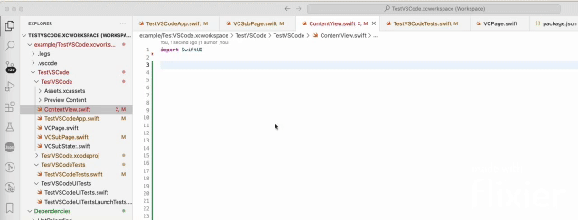

# Xcode iOS Swift IDE 

📦[VSCode Marketplace](https://marketplace.visualstudio.com/items?itemName=FirePlusTeam.vscode-ios) | 🐞
[Github Issues](https://github.com/fireplusteam/ios_vs_code/issues)

You can support this project by giving a star on GitHub ⭐️

[](https://github.com/fireplusteam/ios_vs_code)
[](https://github.com/sponsors/ios_vs_code)

<hr/>
Develop/Build/Debug/Test your xCode projects in VS Code with your favorite extensions.

Before use it make sure you've installed all **dependencies** required for this extension.

<hr/>

## ✅ Autocomplete

[](https://youtu.be/0dXQGY0IIEA)

## 🌳 File Tree Integration

[](https://youtu.be/3C-abUZGkgE)

### Also check [Tricks and Tips](Tricks_and_tips.md)

## Features

-   Supports iOS/MacOS/WatchOS/VisionOS/TvOS
-   Swift/Objective-C/C++ autocompletion
-   Compatibility with CodeLLDB/lldb-dap
-   Debug/Run app on Simulators
-   Debug/Run unit/snapshot/UI tests. Support running single/multiple tests for a class/target/set of classes
-   Support code coverage
-   Run an application on multiple simulator with a single command
-   Support project/workspace
-   Support launch configuration for app
-   Support diff snapshots testing
-   Add/Delete/Rename/Move files/folders inside vscode
-   VS Code workspace generation based on Xcode project/workspace
-   Parsing build/test logs and display in real time

Instead of xCode preview you can use hot reloading [InjectionIII](https://github.com/johnno1962/InjectionIII) which works great with this extension:

-   HotReloading & Injection with [HotReloading](https://github.com/johnno1962/HotReloading)
-   SwiftUI injection property wrapper with [Inject](https://github.com/krzysztofzablocki/Inject) or [HotSwiftUI](https://github.com/johnno1962/HotSwiftUI)

To Debug View Hierarchy you can use this technique [How to debug your view hierarchy using recursiveDescription](https://www.hackingwithswift.com/articles/101/how-to-debug-your-view-hierarchy-using-recursivedescription)

## Dependencies

Before an extension is activated, there's a automatic check if those dependencies are installed and if not, it's ask a user to install them automatically.
Use the following guide to install them manually if any it doesn't work for you:

**Required Dependencies**:

-   🍏 **MacOS** — Other platforms are currently not supported
-   📱 **Xcode** and simulators. Make sure that your Xcode is installed in `/Application/Xcode/` folder

-   **homebrew**:

    ```bash
    /bin/bash -c "$(curl -fsSL https://raw.githubusercontent.com/Homebrew/install/HEAD/install.sh)"
    ```

-   **xcbeautify** tool to prettify the building log output and :

    ```bash
    brew install xcbeautify
    ```

-   **xcodeproj** gem library to make possible to add/delete/rename files in your Xcode project directly from vs code.

    ```bash
    brew install ruby
    gem install xcodeproj
    ```

**Note:**
As [sourcekit-lsp](https://github.com/apple/sourcekit-lsp) updates indexes while building, If you want to have indexes updating even if you have compile errors, you need to give **a full disk control** to Visual Studio Code in Security Settings which allows to install a proxy service for Apple **XCBBuildService** automatically when an extension is activated.
This's just needed to override the **continueBuildingAfterError** property when you build the app and gives you all errors in the project and compile flags possible used by sourcekit for indexing.

## How to use

-   Once you installed all the dependencies, you can open a folder which contains the iOS project. If project or workspace is located in the local folder then an extension will ask you if you want to configure it, otherwise you need to perform command **"Xcode: Select Project/Workspace"** and pick the right project/workspace to work with. You can also switch between multiple projects if they are located in the same folder/subfolders

-   There's ios launch configuration that can be added to `launch.json` file to run and debug ios project (there's also "Xcode: Run App & Debug" snippet)

```json
"configurations": [
    {
        "type": "xcode-lldb",
        "name": "Xcode: Run App & Debug",
        "request": "launch",
        "target": "app",
        "isDebuggable": true,
        "buildBeforeLaunch": "always",
        "lldbCommands": []
    }
]
```

-   Also there're automatically added build tasks which can be used by pressing standard "**Cmd+Shift+B**" shortcut.

-   To make autocompletion to work you may need to clean the project and build it entirely for the first time.

## Extension Settings

This extension contributes the following settings:

-   `vscode-ios.watcher.singleModule`: Enable/disable the autocomplete watch build to update indexes whenever a you modified a file.
-   `vscode-ios.xcb.build.service`: if Enabled, it will ask a user sudo password to replace XCBBuildService with a proxy service which would enhance the Autocomplete feature. This's used to continue compile a project even if there's multiple errors, so all flags are updated

## Known Issues

-   You still need Xcode to use SwiftUI preview or edit storyboard/assets/project settings.
-   Running/debugging on device is not currently supported.
-   [sourcekit-lsp](https://github.com/apple/sourcekit-lsp) use indexing while build. if you find definition or references is not work correctly, just build it to update index or restart Swift LSP in VS Code.
-   When running for the first time, **you need to ensure that the log is complete**, otherwise some files cannot obtain the correct flags.
-   If Generating of project is not working as expected or generates some kind of errors if Xcode opens the same project file, you simply need to update **xcodeproj** lib and ruby library to the latest

    ```bash
    gem install xcodeproj
    ```

## Release Notes

### 0.5.10

It's still under development, so you can face some bugs
